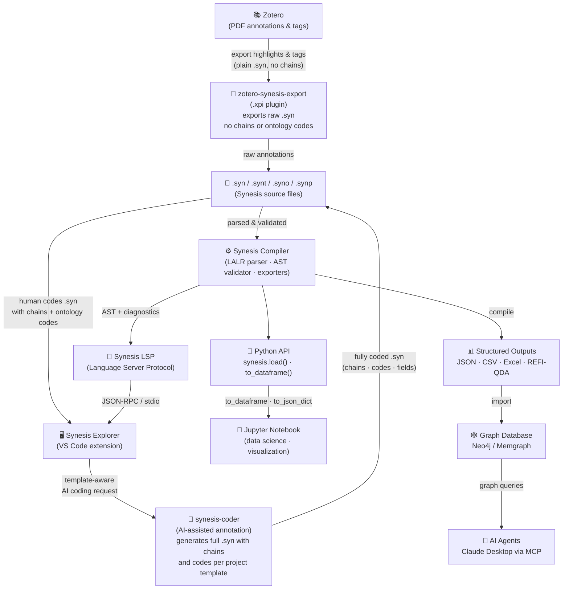
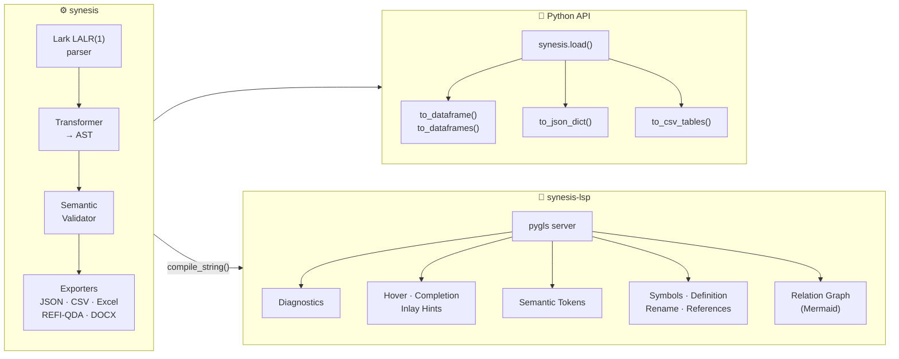

# Synesis

> **The confluence of information into intelligence.**

A Domain-Specific Language and toolchain for transforming qualitative research annotations into structured, auditable knowledge.

[](https://opensource.org/licenses/MIT)
[](https://www.python.org/downloads/)

---

## What is Synesis?

Qualitative research — literature reviews, grounded theory, case studies — generates enormous amounts of interpretive work that is typically lost in unstructured notes, spreadsheets, or proprietary software.

Synesis is a **compiler for analytical thinking**: you write your interpretations in plain-text files with a clean declarative syntax, and the toolchain validates, structures, and exports them as canonical knowledge artifacts. Discipline becomes a form of freedom — by delegating logical organization to a formal structure, the mind stays free for what truly matters: interpretation, nuance, and insight.

The result is true **σύνεσις** — the convergence of evidence fragments into an intelligible, auditable, and technically rigorous whole.

---

## The Ecosystem



---

## Components

| Repository | Language | Role |
|---|---|---|
| **synesis** ← *this* | Python | Compiler, parser, validator, exporters, Python API |
| [synesis-lsp](https://github.com/synesis-lang/synesis-lsp) | Python | Language Server — diagnostics, hover, completion, semantic tokens |
| [synesis-explorer](https://github.com/synesis-lang/synesis-explorer) | JS/TS | VS Code extension — tree views, graph viewer, themes |
| [zotero-synesis-export](https://github.com/synesis-lang/zotero-synesis-export) | JavaScript | Zotero 7 plugin — exports PDF highlights and tags as plain `.syn` (no chains or ontology codes) |
| [synesis2neo4j](https://github.com/synesis-lang/synesis2neo4j) | Python | Import compiled knowledge into Neo4j / Memgraph |
| [synesis-coder](https://github.com/synesis-lang/synesis-coder) | Python | AI-assisted annotation — generates fully coded `.syn` files (chains, codes, fields) conforming to the project template |

---

## A Complete Example

All files below are from the `case-studies/Basic/` project.

### `references.bib`
```bibtex
@article{smith2024,
    author  = {Smith, Jane},
    title   = {Understanding Community Resilience},
    journal = {Journal of Social Research},
    year    = {2024},
    volume  = {12},
    pages   = {45--67}
}
```

### `template.synt` — field schema and validation rules
```
SOURCE FIELDS
    OPTIONAL description
END SOURCE FIELDS

ITEM FIELDS
    REQUIRED citation, note, code
END ITEM FIELDS

FIELD citation TYPE QUOTATION
    SCOPE ITEM
    DESCRIPTION Direct quote or selected excerpt from the data source
END FIELD

FIELD note TYPE MEMO
    SCOPE ITEM
    DESCRIPTION Analytical memo recording interpretations, emerging patterns, or causal reasoning
END FIELD

FIELD code TYPE CODE
    SCOPE ITEM
    DESCRIPTION Codes or descriptors applied to this excerpt
END FIELD

ONTOLOGY FIELDS
    REQUIRED definition, group
END ONTOLOGY FIELDS

FIELD definition TYPE TEXT
    SCOPE ONTOLOGY
    DESCRIPTION Clear definition of the code, with inclusion/exclusion criteria
END FIELD

FIELD group TYPE TOPIC
    SCOPE ONTOLOGY
    DESCRIPTION Broader thematic domain that groups these codes
END FIELD
```

### `annotations.syn` — your research data
```
SOURCE @smith2024
    description: Qualitative study on community resilience strategies in urban contexts.
END SOURCE

ITEM @smith2024
    citation: "People here look out for each other. When the flood came, nobody waited
        for official help — neighbors just organized themselves."

    note: Participant describes spontaneous collective action as a primary resilience
        mechanism, bypassing formal institutions. Suggests strong bonding social capital.

    code: Social_Cohesion, Collective_Action
END ITEM
```

### `ontology.syno` — controlled vocabulary
```
ONTOLOGY Social_Cohesion
    definition: The degree to which community members trust, support, and cooperate
        with one another. Applies when participants describe solidarity, mutual aid,
        or a shared sense of belonging.
    group: Community_Resilience
END ONTOLOGY

ONTOLOGY Collective_Action
    definition: Coordinated efforts by community members to address shared challenges
        without formal institutional direction. Applies when groups self-organize in
        response to a problem or crisis.
    group: Community_Resilience
END ONTOLOGY
```

### `project.synp` — the entry point
```
PROJECT demo
    TEMPLATE "template.synt"
    INCLUDE BIBLIOGRAPHY "references.bib"
    INCLUDE ANNOTATIONS "annotations.syn"
    INCLUDE ONTOLOGY "ontology.syno"
END PROJECT
```

---

## Python API — Use in Jupyter Notebooks

Compile entirely in-memory, no file I/O required:

```python
import synesis

result = synesis.load(
    project_content=open("project.synp").read(),
    template_content=open("template.synt").read(),
    annotation_contents={"annotations.syn": open("annotations.syn").read()},
    ontology_contents={"ontology.syno": open("ontology.syno").read()},
    bibliography_content=open("references.bib").read(),
)

if result.success:
    # Export as pandas DataFrames
    items_df   = result.to_dataframe("items")
    codes_df   = result.to_dataframe("codes")
    chains_df  = result.to_dataframe("chains")

    # Export as JSON dict
    data = result.to_json_dict()

    # Compilation stats
    print(result.stats)
    # CompilationStats(source_count=1, item_count=1, ontology_count=2, code_count=2)
else:
    print(result.get_diagnostics())
```

Available tables: `sources`, `items`, `ontologies`, `codes`, `chains`.

---

## CLI

```bash
# Install
pip install synesis

# Compile a project
synesis compile project.synp --output results/

# Validate only (no output files)
synesis validate project.synp
```

---

## Potential Applications

| Domain | How Synesis helps |
|---|---|
| **Systematic literature reviews** | Annotate hundreds of papers with a shared template; export clean datasets for meta-analysis |
| **Grounded Theory / Thematic Analysis** | Build and validate code systems with ontological constraints; trace every code to its source |
| **Mixed-methods research** | Bridge qualitative interpretation with quantitative formats for R or Python workflows |
| **Knowledge graphs** | Compile research findings into Neo4j; model causal chains as graph edges |
| **AI-augmented analysis** | Feed structured annotations as context to LLMs via MCP; responses traceable to source evidence |
| **Biblical / exegetical studies** | Code canonical texts with relational chains; integrate classical and patristic corpora |
| **Longitudinal projects** | Template versioning and strict validation prevent concept drift across research phases |

---

## Language Features

**Sources & Items** — Every annotation is traceable to a BibTeX reference.

**Templates** — Define field schemas with types (`CODE`, `TEXT`, `CHAIN`, `SCALE`, `QUOTATION`...), validation rules (`REQUIRED`, `OPTIONAL`, `FORBIDDEN`), and constraints (`ARITY`, `BUNDLE`, `VALUES`).

**Ontologies** — Controlled vocabularies validated at compile time. Every code must exist in the ontology — typos and orphaned concepts are caught immediately.

**Chains** — Causal or relational links: `Trust -> ENABLES -> Acceptance`. Validated against `RELATIONS` and `ARITY` constraints.

**GUIDELINES** — Instructional text embedded in template field definitions for annotators, never parsed as code.

---

## VS Code Integration

The [Synesis Explorer](https://github.com/synesis-lang/synesis-explorer) extension provides:

- Real-time diagnostics (errors and warnings as you type)
- Semantic syntax highlighting (AST-driven, not regex)
- Tree explorers for References, Codes, Relations, and Ontology
- Go-to-definition, rename, and hover documentation
- Relation graph viewer (Mermaid → SVG)
- Abstract viewer with BibTeX highlights
- Synesis Dark and Light themes

Requires `synesis-lsp` running as the language server.

---

## File Types

| Extension | Purpose |
|---|---|
| `.syn` | Annotation files — sources and items |
| `.synp` | Project file — declares template, bibliography, includes |
| `.synt` | Template file — field schema and validation rules |
| `.syno` | Ontology file — controlled vocabulary of codes |
| `.bib` | BibTeX bibliography (standard format) |

---

## Architecture



---

## License

MIT — see [LICENSE](LICENSE).
