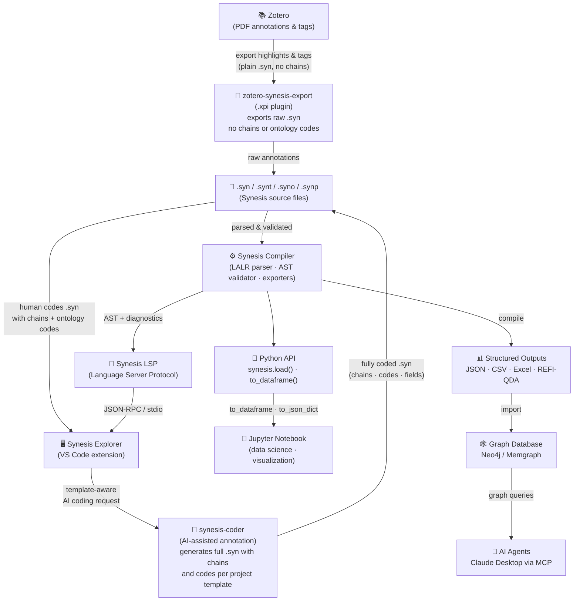

# Synesis

> **The confluence of information into intelligence.**

A Domain-Specific Language and toolchain for transforming qualitative research annotations into structured, auditable knowledge.

[](https://opensource.org/licenses/MIT)
[](https://www.python.org/downloads/)

---

## What is Synesis?

Qualitative research — literature reviews, grounded theory, case studies — generates enormous amounts of interpretive work that is typically lost in unstructured notes, spreadsheets, or proprietary software.

Synesis is a **compiler for analytical thinking**: you write your interpretations in plain-text files with a clean declarative syntax, and the toolchain validates, structures, and exports them as canonical knowledge artifacts. Discipline becomes a form of freedom — by delegating logical organization to a formal structure, the mind stays free for what truly matters: interpretation, nuance, and insight.

The result is true **σύνεσις** — the convergence of evidence fragments into an intelligible, auditable, and technically rigorous whole.

---

## The Ecosystem



---

## Repositories

| Repository | Language | Role |
|---|---|---|
| [synesis](https://github.com/synesis-lang/synesis) | Python | Compiler, parser, validator, exporters, Python API |
| [synesis-lsp](https://github.com/synesis-lang/synesis-lsp) | Python | Language Server — diagnostics, hover, completion, semantic tokens |
| [synesis-explorer](https://github.com/synesis-lang/synesis-explorer) | JS/TS | VS Code extension — tree views, graph viewer, themes |
| [zotero-synesis-export](https://github.com/synesis-lang/zotero-synesis-export) | JavaScript | Zotero 7 plugin — exports PDF highlights and tags as plain `.syn` (no chains or ontology codes) |
| [synesis2neo4j](https://github.com/synesis-lang/synesis2neo4j) | Python | Import compiled knowledge into Neo4j / Memgraph |
| [synesis-coder](https://github.com/synesis-lang/synesis-coder) | Python | AI-assisted annotation — generates fully coded `.syn` files (chains, codes, fields) conforming to the project template |

---

## Potential Applications

| Domain | How Synesis helps |
|---|---|
| **Systematic literature reviews** | Annotate hundreds of papers with a shared template; export clean datasets for meta-analysis |
| **Grounded Theory / Thematic Analysis** | Build and validate code systems with ontological constraints; trace every code to its source |
| **Mixed-methods research** | Bridge qualitative interpretation with quantitative formats for R or Python workflows |
| **Knowledge graphs** | Compile research findings into Neo4j; model causal chains as graph edges |
| **AI-augmented analysis** | Feed structured annotations as context to LLMs via MCP; responses traceable to source evidence |
| **Biblical / exegetical studies** | Code canonical texts with relational chains; integrate classical and patristic corpora |
| **Longitudinal projects** | Template versioning and strict validation prevent concept drift across research phases |

---

## Quick Start

```bash
pip install synesis synesis-lsp
```

Install the [VS Code extension](https://github.com/synesis-lang/synesis-explorer/releases) and the [Zotero plugin](https://github.com/synesis-lang/zotero-synesis-export/releases). Full documentation at **[synesis-lang.github.io](https://synesis-lang.github.io)**.
